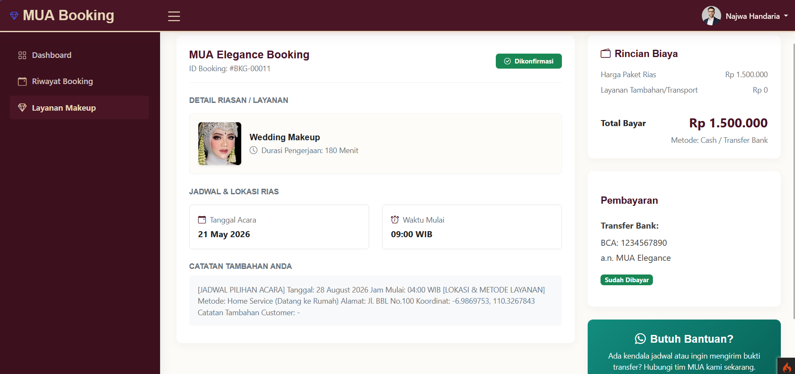

# MUA Booking System

MUA Booking System adalah aplikasi sistem informasi berbasis web yang dirancang untuk memodernisasi alur kerja operasional bisnis Make Up Artist (MUA) yang dibangun menggunakan CodeIgniter 4. Sistem ini memberikan solusi bagi pelanggan untuk melakukan reservasi layanan dan bagi admin untuk mengelola pesanan dengan integrasi data spasial.

## Tampilan Aplikasi
Berikut adalah dokumentasi tampilan aplikasi MUA Booking:

| Dashboard | Booking Data | Service List | Detail Booking |
| :---: | :---: | :---: | :---: |
|  |  |  |  |

## Deskripsi Sistem
Aplikasi MUA Booking memfasilitasi dua alur layanan utama:
- Layanan Gallery: Pelanggan datang langsung ke studio.
- Home Service: Penata rias datang ke lokasi pelanggan dengan dukungan integrasi peta (Leaflet.js) untuk akurasi lokasi.

## Fitur
- Reservasi Dinamis: Manajemen booking dua metode (Gallery & Home Service) dengan validasi jadwal otomatis.
- Integrasi Peta Spasial: Implementasi Leaflet.js untuk pemilihan lokasi titik jemput secara akurat melalui pin-drop marker.
- Geocoding: Pencarian lokasi otomatis untuk mempermudah pelanggan menentukan alamat layanan.
- Panel Admin: Dasbor terpusat untuk manajemen status pesanan (pending, confirmed, done) dan visualisasi lokasi pelanggan.
- Komunikasi Instan: Integrasi tombol WhatsApp untuk koordinasi langsung antara admin dan pelanggan.
- Sistem Stabil: Error handling pada pemuatan peta untuk memastikan aplikasi tetap berjalan meski koneksi tidak stabil.

## Cara Menjalankan
1. Clone repository: git clone [https://github.com/yolaenova/booking.git](https://github.com/yolaenova/booking.git)
2. Import database .sql ke MySQL.
3. Sesuaikan konfigurasi database di file .env.
4. Jalankan perintah: php spark serve

## ERD (Database)

## Tech Stack
- **Framework:** CodeIgniter 4
- **Maps:** Leaflet.js (OpenStreetMap)
- **Database:** MySQL
- **Frontend:** Bootstrap 5
- **Tools:** GitHub, VS Code, Laragon

## 👤 Pengembang
- Najwa Handaria Suparna (A11.2024.16039)
- Yola Enova Sabilla (A11.2024.16039) 