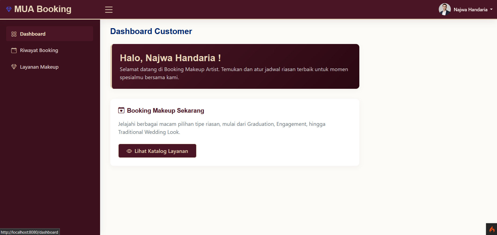
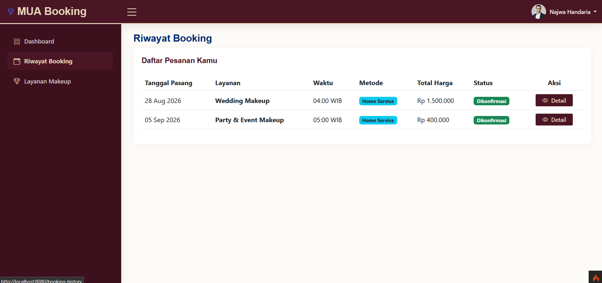
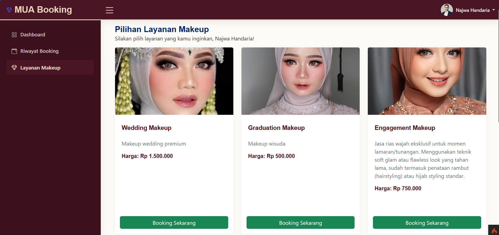
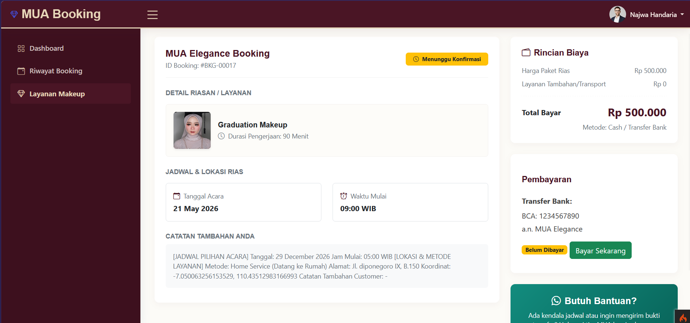
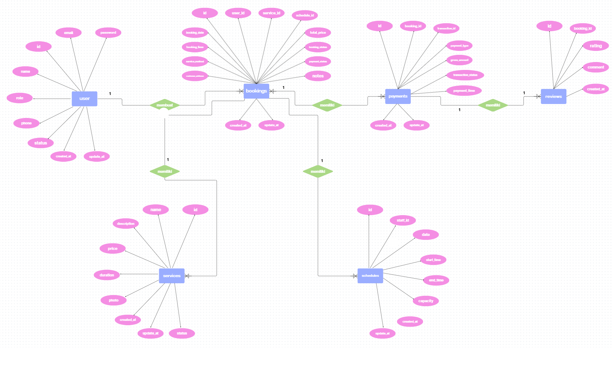

# MUA Booking System

MUA Booking System adalah aplikasi sistem informasi berbasis web yang dirancang untuk memodernisasi alur kerja operasional bisnis Make Up Artist (MUA) yang dibangun menggunakan CodeIgniter 4. Sistem ini memberikan solusi bagi pelanggan untuk melakukan reservasi layanan dan bagi admin untuk mengelola pesanan dengan integrasi data spasial.

## Tampilan Aplikasi
Berikut adalah dokumentasi tampilan aplikasi MUA Booking:

| Dashboard | Booking Data | Service List | Detail Booking |
| :---: | :---: | :---: | :---: |
|  |  |  |  |

## Deskripsi Sistem
Aplikasi MUA Booking memfasilitasi dua alur layanan utama:
- Layanan Gallery: Pelanggan datang langsung ke studio.
- Home Service: Penata rias datang ke lokasi pelanggan dengan dukungan integrasi peta (Leaflet.js) untuk akurasi lokasi.

## Fitur
- Reservasi Dinamis: Manajemen booking dua metode (Gallery & Home Service) dengan validasi jadwal otomatis.
- Integrasi Peta Spasial: Implementasi Leaflet.js untuk pemilihan lokasi titik jemput secara akurat melalui pin-drop marker.
- Geocoding: Pencarian lokasi otomatis untuk mempermudah pelanggan menentukan alamat layanan.
- Panel Admin: Dasbor terpusat untuk manajemen status pesanan (pending, confirmed, done) dan visualisasi lokasi pelanggan.
- Komunikasi Instan: Integrasi tombol WhatsApp untuk koordinasi langsung antara admin dan pelanggan.
- Sistem Stabil: Error handling pada pemuatan peta untuk memastikan aplikasi tetap berjalan meski koneksi tidak stabil.

## Cara Instalasi

1. **Clone repository**
   ```bash
   git clone https://github.com/yolaenova/booking.git
   cd booking
   ```

2. **Install dependency PHP (Composer)**
   ```bash
   composer install
   ```
   Perintah ini akan membuat folder `vendor/` berisi CodeIgniter 4 dan library pendukung (termasuk Midtrans SDK), sesuai versi yang terkunci di `composer.lock`. Folder `vendor/` tidak di-commit ke repository.

3. **Salin file environment**
   ```bash
   cp env .env
   ```
   (Di Windows tanpa Git Bash, cukup duplikat file `env` lalu ganti nama menjadi `.env`)

4. **Buat database**
   Buat database baru bernama `booking` di MySQL (misalnya lewat phpMyAdmin atau `CREATE DATABASE booking;`).

5. **Sesuaikan isi file `.env`** — lihat detail di bagian [Konfigurasi .env](#konfigurasi-env).

6. **Jalankan migration**
   ```bash
   php spark migrate
   ```

7. **Jalankan seeder** (mengisi data awal: akun admin, staff, dan data layanan)
   ```bash
   php spark db:seed DatabaseSeeder
   ```

8. **Jalankan server**
   ```bash
   php spark serve
   ```

9. Buka aplikasi di browser: `http://localhost:8080`

## Konfigurasi .env

Buka file `.env`, cari (atau tambahkan) baris berikut, lalu sesuaikan dengan environment kamu:

```env
#--------------------------------------------------------------------
# DATABASE
#--------------------------------------------------------------------
database.default.hostname = localhost
database.default.database = booking
database.default.username = root
database.default.password =
database.default.DBDriver = MySQLi
database.default.port     = 3306

#--------------------------------------------------------------------
# MIDTRANS (Payment Gateway)
#--------------------------------------------------------------------
midtrans.serverKey    = your-midtrans-server-key
midtrans.clientKey    = your-midtrans-client-key
midtrans.isProduction = false
```

> **Catatan:** `serverKey` dan `clientKey` didapat dari dashboard Midtrans Sandbox (mode sandbox untuk testing, atau production untuk transaksi asli). Jangan pernah mem-push file `.env` yang sudah berisi key asli ke repository publik.

## Akun Demo

| Role | Email | Password | Keterangan |
| :--- | :--- | :--- | :--- |
| Admin | `admin@gmail.com` | `admin123` | Akses penuh: kelola booking, layanan, WhatsApp |
| Staff | `staff@gmail.com` | `staff123` | Saat ini baru tampilan halaman "Selamat Datang" |
| Customer | — | — | Belum ada akun default, silakan **daftar mandiri** lewat halaman `/register` di halaman login |

## ERD (Database)


## Tech Stack
- **Framework:** CodeIgniter 4
- **Maps:** Leaflet.js (OpenStreetMap)
- **Payment Gateway:** Midtrans
- **Database:** MySQL
- **Frontend:** Bootstrap 5
- **Tools:** GitHub, VS Code, Laragon

## 👤 Pengembang
- Najwa Handaria Suparna (A11.2024.16039)
- Yola Enova Sabilla (A11.2024.16049) 
